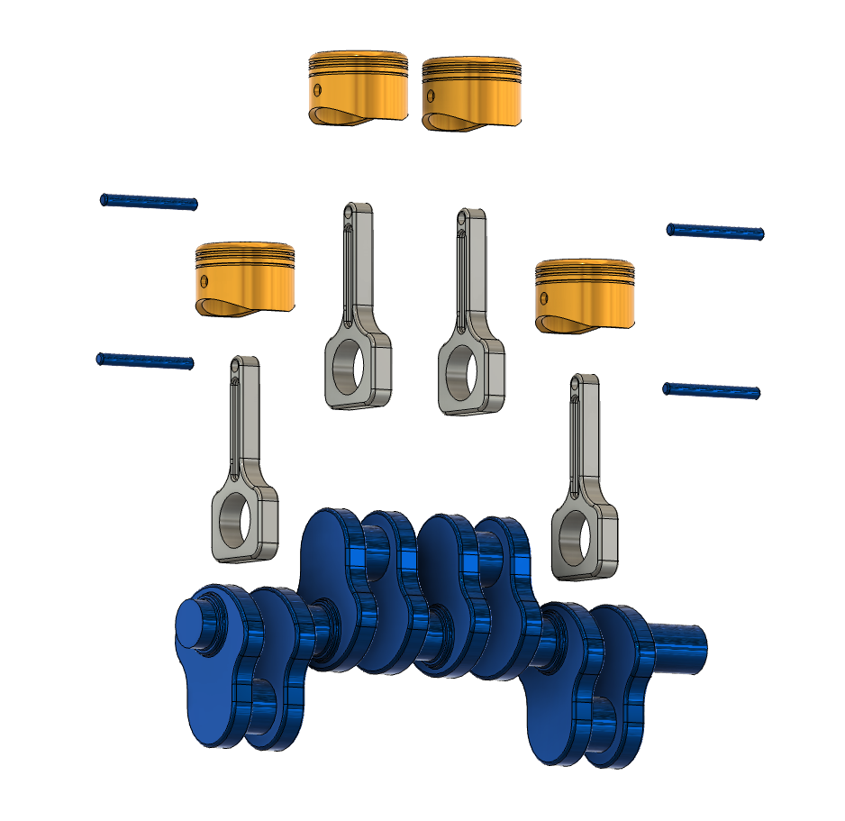
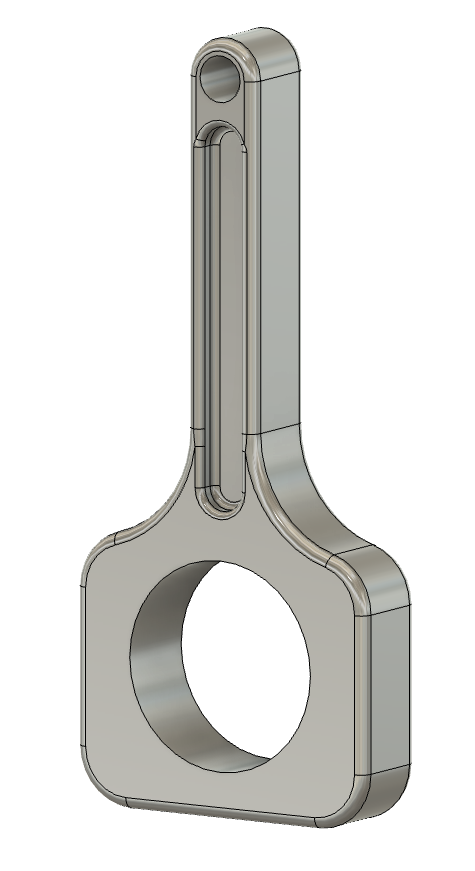
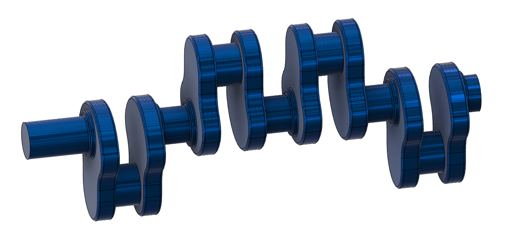
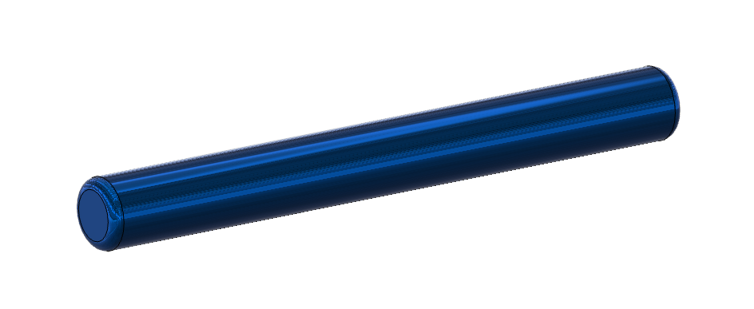
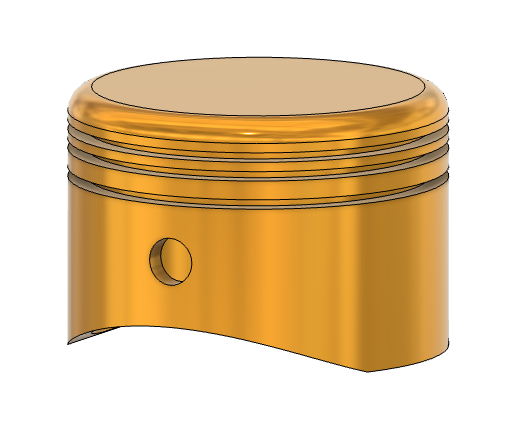

# Piston-Crankshaft CAD Assembly

Mechanical design portfolio project: a 4-piston inline crankshaft assembly with
manufacturing-ready documentation, GD&T tolerancing, and planned FEA validation.

**Badges:** `Fusion 360` | `FreeCAD` | `ASME Y14.5` | `Mechanical Design`

---

## Demo

<table>
  <tr>
    <td align="center">
      <!-- Turntable animation: 360-degree rotation of the full assembly.
           Isometric view, ~30-degree elevation, white background.
           Steel crankshaft, aluminum pistons, forged steel rods.
           Smooth 8-second rotation at 600px width.
           TODO: Convert assets/animations/turntable.mov to turntable.gif -->
      
      <br/>
      <em>Turntable Rotation</em>
    </td>
    <td align="center">
      <!-- Exploded view: all 13 components separated to show assembly order.
           Blue crankshaft at bottom, silver connecting rods, gold pistons,
           blue wrist pins. Isometric angle matching the turntable.
           White background, color-coded component separation. -->
      
      <br/>
      <em>Exploded View</em>
    </td>
  </tr>
</table>

---

## Assembly Process

The following animation shows the step-by-step assembly sequence, from individual
components to the fully constrained assembly:

<!-- Assembly animation: TODO: Convert assets/animations/assembly.mov to assembly.gif -->


---

## Why This Project

This project demonstrates the complete mechanical design workflow from parametric
CAD modeling through manufacturing-ready documentation. A 13-component inline
piston-crankshaft assembly is designed in Fusion 360 with fully constrained
mates, realistic material assignments, and a bill of materials. The deliverables
include 2D engineering drawings with ASME Y14.5 GD&T callouts, exploded and
section views for assembly communication, and a structured asset pipeline for
web-optimized portfolio visuals. The crankshaft GD&T scheme establishes datum
reference frames, specifies form and position tolerances on bearing surfaces, and
defines runout limits critical to engine balancing. Planned extensions include
FreeCAD FEM stress validation and design-for-manufacturing analysis for each
component.

---

## Key Capabilities

| Category | Description |
|----------|-------------|
| **CAD Modeling** | 13-component parametric assembly in Fusion 360 with fully constrained mates |
| **GD&T Tolerancing** | ASME Y14.5 datum schemes, form tolerances, and position callouts on the crankshaft |
| **FEA Validation** | FreeCAD FEM workbench for static stress analysis (planned) |
| **Manufacturing** | DFM analysis, material selection rationale, process recommendations per component |
| **Materials** | Crankshaft: Blue chrome (AISI 4340 Steel), Pistons: Burnished gold (A390 Aluminum), Connecting Rods: Titanium silver (4340 Steel, forged), Wrist Pins: Blue chrome (52100 Bearing Steel) |
| **Documentation** | 2D engineering drawings, BOM, exploded views, section views, turntable animation |

---

## Assembly Architecture

```
                        +-----------+
                        | Flywheel  |
                        +-----+-----+
                              |
              +---------------+---------------+
              |          CRANKSHAFT           |
              |  (AISI 4340 Steel, 1 pc)     |
              +--+------+------+------+------+--+
                 |      |      |      |      |
           Throw 1  Throw 2  Throw 3  Throw 4
                 |      |      |      |      |
              +--+--+ +--+--+ +--+--+ +--+--+
              | Rod | | Rod | | Rod | | Rod |
              | (4340| | (4340| | (4340| | (4340|
              |Forg)| |Forg)| |Forg)| |Forg)|
              +--+--+ +--+--+ +--+--+ +--+--+
                 |      |      |      |      |
              +--+--+ +--+--+ +--+--+ +--+--+
              |Pin  | |Pin  | |Pin  | |Pin  |
              |52100| |52100| |52100| |52100|
              +--+--+ +--+--+ +--+--+ +--+--+
                 |      |      |      |      |
              +--+--+ +--+--+ +--+--+ +--+--+
              |Pist | |Pist | |Pist | |Pist |
              |A390 | |A390 | |A390 | |A390 |
              |(Al) | |(Al) | |(Al) | |(Al) |
              +-----+ +-----+ +-----+ +-----+

  Cylinder 1    Cyl 2    Cyl 3    Cyl 4
```

---

## Component Gallery

| Connecting Rod | Crankshaft |
|----------------|------------|
|  |  |
| *I-beam cross-section, big end and small end bores* | *4-throw design, main journals and crankpins* |

| Wrist Pin | Piston |
|-----------|--------|
|  |  |
| *52100 bearing steel, chamfered edges* | *A390 aluminum, ring grooves and pin bore* |

---

## Bill of Materials

| # | Part | Material | Qty | Manufacturing | Key Tolerance |
|---|------|----------|-----|---------------|---------------|
| 1 | Crankshaft | AISI 4340 Steel | 1 | CNC turning + milling | Cylindricity 0.010 mm |
| 2 | Piston | A390 Aluminum | 4 | CNC turning | Dia +/- 0.025 mm |
| 3 | Connecting Rod | 4340 Steel (Forged) | 4 | Forging + CNC machining | Bore H7 |
| 4 | Wrist Pin | 52100 Bearing Steel | 4 | Centerless grinding | Dia h6 |

---

## Design for Manufacturing

### Material Selection Rationale

| Component | Material | Visual Finish | Why This Material |
|-----------|----------|---------------|-------------------|
| Crankshaft | AISI 4340 Steel | Blue chrome | High fatigue strength, excellent machinability, industry-standard for crankshafts. Nickel-chromium-molybdenum alloy provides through-hardenability for uniform journal hardness. |
| Piston | A390 Aluminum | Burnished gold | Low density reduces reciprocating mass. High thermal conductivity dissipates combustion heat. Silicon content provides wear resistance against cylinder walls. |
| Connecting Rod | 4340 Steel (Forged) | Titanium silver | Forging produces grain flow that follows the load path from small end to big end, improving fatigue resistance over machined-from-bar stock. |
| Wrist Pin | 52100 Bearing Steel | Blue chrome | High carbon-chromium steel achieves 60-64 HRC hardness. Excellent wear resistance and surface finish for the oscillating bearing interface. |

### Process Summary

| Component | Primary Process | Secondary Process | Surface Finish |
|-----------|----------------|-------------------|----------------|
| Crankshaft | CNC turning (journals) | CNC milling (webs, keyway) | Ra 0.4 um on journals |
| Piston | CNC turning (profile) | Groove cutting (ring lands) | Ra 0.8 um on skirt |
| Connecting Rod | Hot forging | CNC machining (bores, parting face) | Ra 1.6 um on non-critical |
| Wrist Pin | Centerless grinding | Superfinishing | Ra 0.1 um on OD |

---

## GD&T Summary

Planned GD&T callouts for the crankshaft (ASME Y14.5-2018):

| Feature | Tolerance Type | Value | Datum | Rationale |
|---------|---------------|-------|-------|-----------|
| Main journal OD | Cylindricity | 0.010 mm | A | Bearing surface form control |
| Main journal OD | Diameter | 50.000 +/- 0.013 mm | A | ISO h6 fit with bearing bore |
| Crankpin OD | Cylindricity | 0.012 mm | A | Rod bearing surface form control |
| Crankpin position | Position | 0.025 mm | A, B | Stroke accuracy (affects compression ratio) |
| Flange face | Flatness | 0.015 mm | B | Flywheel mounting surface |
| Flange face | Perpendicularity | 0.020 mm | A | Axial alignment of flywheel |
| Overall runout | Circular runout | 0.030 mm | A, B | Engine balance requirement |
| Keyway width | Position | 0.050 mm | A, B, C | Timing gear indexing accuracy |

*GD&T application in progress -- crankshaft drawings with ASME Y14.5 callouts coming soon.*

---

## FEA Analysis

Planned structural validation using FreeCAD FEM workbench:

| Metric | Target | Status |
|--------|--------|--------|
| Static stress (von Mises) | < 860 MPa (yield strength of 4340) | Planned |
| Max displacement | < 0.050 mm | Planned |
| Safety factor | > 2.0 | Planned |
| Mesh type | Second-order tetrahedral (C3D10) | Planned |
| Boundary conditions | Fixed main journals, 5 kN load on crankpin | Planned |

*FEA analysis in progress -- FreeCAD FEM stress validation coming soon.*

---

## Media Assets

| Asset | Format | Description |
|-------|--------|-------------|
| Turntable rotation | MOV | 360-degree view of the full assembly |
| Assembly process | MOV | Step-by-step assembly animation |
| Crankshaft rotation | MOV | Functioning assembly showing piston reciprocation |
| Exploded view | PNG | Color-coded component separation |
| Component details | PNG | Individual part close-ups (4 images) |

---

## Tech Stack

| Tool | Purpose |
|------|---------|
| Fusion 360 | Parametric CAD modeling, assembly, 2D drawings |
| FreeCAD FEM | Finite element stress analysis (planned) |
| ASME Y14.5-2018 | Geometric dimensioning and tolerancing standard |
| ffmpeg | Video-to-GIF conversion for portfolio assets |
| gifsicle | GIF optimization for web delivery |

---

## Project Structure

```
piston-crankshaft-cad/
|-- README.md                          # This file
|-- CAPTURE_GUIDE.md                   # Fusion 360 capture instructions
|-- LICENSE                            # MIT License
|-- .gitignore
|-- assets/
|   |-- animations/
|   |   |-- turntable.mov              # 360-degree rotation (to be converted to GIF)
|   |   |-- assembly.mov               # Assembly process animation (to be converted to GIF)
|   |   |-- crankshaft_rotation.mov    # Functioning assembly motion (to be converted to GIF)
|   |-- images/
|   |   |-- assembly_exploded.png      # Color-coded exploded view
|   |   |-- connecting_rod_detail.png  # Connecting rod close-up
|   |   |-- crankshaft_detail.png      # Crankshaft close-up
|   |   |-- piston_detail.png          # Piston close-up
|   |   |-- wrist_pin_detail.png       # Wrist pin close-up
|   |-- cad/
|       |-- crankshaft_assembly.step   # STEP export for cross-platform use
|-- drawings/
|   |-- crankshaft_drawing.pdf         # 2D drawing with GD&T
|   |-- bom.csv                        # Bill of materials (CSV)
|-- fea/
|   |-- results/                       # FEA output plots (planned)
|-- scripts/
    |-- process_assets.sh              # Video-to-GIF conversion pipeline
```

---

## References

1. ASME Y14.5-2018, *Dimensioning and Tolerancing*. American Society of Mechanical Engineers.
2. Shigley, J.E., Mischke, C.R., Budynas, R.G. *Shigley's Mechanical Engineering Design*, 11th Ed. McGraw-Hill, 2019.
3. *Machinery's Handbook*, 31st Edition. Industrial Press, 2016.
4. FreeCAD FEM Workbench Documentation. https://wiki.freecad.org/FEM_Workbench
